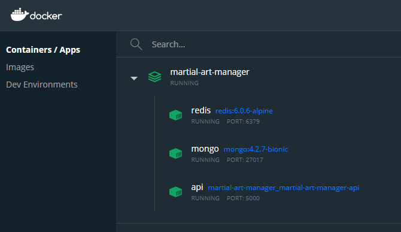

# martial-art-manager

### Installation and configuration for devs
#### Clone the project

**ssh**
```sh
git clone git@github.com:leonardobalduino/martial-art-manager.git
```

**https**
```sh
git clone https://github.com/leonardobalduino/martial-art-manager.git
```

### Steps to run teh martial art manager

#### 1º Execute in terminal
_Linux_   -> `cp env-docker ./.env`

_Windows_ -> `copy env-docker .env`

#### 2º Execute in terminal
_Docker_ -> `docker-compose up -d --build`



#### 3º Links of docs and swagger

Link for redocs [redocs](http://localhost:5000/api/docs/).

Link for swagger [swagger](http://localhost:5000/api/swagger/).

Link for json [martial-art-manager.json](http://localhost:5000/api/martial-art-manager.json).

#### 4º User to auth
At first request it will create a user admin with this credentials:

Login: _admin_

Password: _admin_